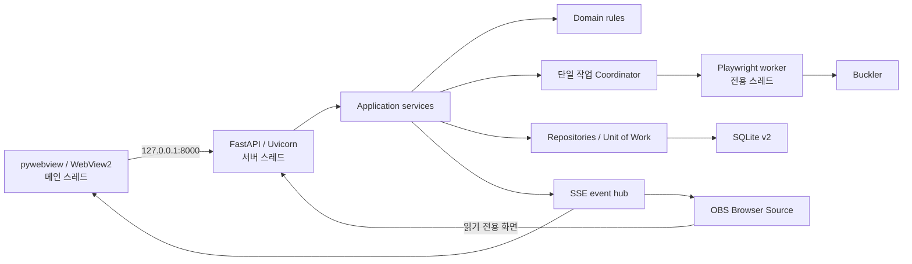
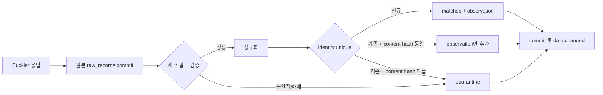

# SF6Viewer v2 마스터 설계

- 상태: 승인됨
- 승인 방식: 사용자가 후속 비파괴 결정을 위임함
- 작성일: 2026-07-19
- 우선순위: 안정성·데이터 정확성 → 데스크톱 UX → OBS 화면
- 기준 플랫폼: Windows 10/11 x64 배포판, macOS 소스 실행 지원

## 1. 결정 요약

SF6Viewer v2는 기존 코드를 점진적으로 확장하지 않고 새 구조로 다시 작성한다. 기존 v1 데이터는 읽기 전용 원본과 검증된 백업을 보존한 채 v2 저장소로 무손실 이관한다.

제품은 같은 PC에서 한 명의 SF6 계정을 관리하는 로컬 데스크톱 앱이다. Python 코어, FastAPI 루프백 서버, pywebview/WebView2 창, React·TypeScript UI, SQLite, Playwright 수집기로 구성한다. 외부 네트워크에 API를 공개하거나 클라우드 동기화를 제공하지 않는다.

핵심 제품 원칙은 다음과 같다.

1. 확인되지 않은 값을 정상 데이터처럼 저장하거나 표시하지 않는다.
2. 원본 관측값을 먼저 보존하고, 검증을 통과한 값만 정규화한다.
3. 중복 방지와 동시성 안전성은 애플리케이션 추측이 아니라 DB 제약으로 보장한다.
4. 수집 실패 시 마지막 정상 데이터를 유지하고 실패 원인과 다음 행동을 명시한다.
5. OBS URL과 레이아웃 계약은 릴리스 간 호환성을 유지한다.

## 2. 목표와 비범위

### 2.1 목표

- 현재 확인된 기존 경기 841건을 한 건도 잃지 않고 이관한다.
- 수동·자동 수집 요청이 겹쳐도 Playwright 작업은 정확히 하나만 실행한다.
- 네트워크 오류, 인증 만료, Buckler DOM/계약 변경, 날짜 파싱 실패, DB 오류를 서로 구분한다.
- 수집기 계약이 깨졌을 때 `새 경기 0건 수집 성공`으로 오인하지 않는다.
- 강제 종료 또는 재시작 후 미완료 수집과 마이그레이션을 일관되게 복구한다.
- 독립 데스크톱 창에서 상태 중심 홈, 경기 기록, 분석, 방송, 설정을 제공한다.
- `/broadcast`, `/stats`, `/overlay`의 고정 로컬 URL과 화면 규격을 제공한다.
- 인터넷 연결이 끊겨도 앱 UI와 마지막 정상 OBS 데이터가 표시된다.
- Windows EXE 설치·실행·제거 경로를 재현 가능하게 만든다.

### 2.2 비범위

- 다중 SF6 계정
- LAN 또는 인터넷을 통한 원격 접속
- 클라우드 동기화와 사용자 계정 서버
- 모바일 전용 UI
- 여러 Playwright worker의 병렬 수집
- 영구적으로 열린 전역 Playwright browser/context
- 임의 포트 자동 전환
- 기존 원본 DB와 인증 파일의 자동 삭제
- 첫 릴리스의 라이트 테마와 표현 중심 애니메이션

## 3. 성공 기준

v2 첫 안정 릴리스는 아래 조건을 모두 만족해야 한다.

- 동일 v1 DB를 여러 번 이관해도 v2 행 수와 집계가 변하지 않는다.
- `v1 player 행 = 활성 계정 + provenance/격리 player`, `v1 match 행 = 정규화 관측 + 중복 관측 + 격리 match`가 각각 성립한다.
- 현재 사용자 v1 snapshot의 release acceptance는 841건·433승·408패와 날짜 범위·필수 필드 checksum이 일치하는 것이다. runtime 이관기는 이 숫자를 상수로 사용하지 않고 각 source에서 계산한 count와 canonical multiset을 기준으로 검증한다.
- 수집 요청 100개를 동시에 보내도 active Playwright 작업이 하나이고 중복 요청은 기존 job으로 합쳐진다.
- selector/응답 계약 파손은 성공이 아니라 `CONTRACT_CHANGED`로 종료되고 새 정규화 데이터가 생기지 않는다.
- 날짜를 해석하지 못한 레코드는 현재 시각으로 대체되지 않고 격리된다.
- DB commit 전에는 UI와 OBS에 `data.changed`가 전달되지 않는다.
- 창 종료 중 수집이 실행 중이어도 완료된 transaction은 보존되고 미완료 transaction은 rollback된다.
- 기본 1280×820, 최소 900×640, Windows 배율 100~200%에서 주요 기능을 사용할 수 있다.
- Broadcast의 로딩·오류 상태에서 가짜 선수명, 샘플값, 가짜 0%가 나타나지 않는다.

## 4. 전체 구조



단일 EXE와 단일 애플리케이션 프로세스를 사용한다. 장기 수명 실행 단위는 세 개다.

| 실행 단위 | 책임 |
|---|---|
| 메인 스레드 | pywebview 창, WebView2, 네이티브 파일 선택, 창 종료 |
| Uvicorn 스레드 | 루프백 REST, SSE, 정적 UI, scheduler |
| Collection worker 스레드 | 로그인·수집·재처리와 Playwright 동기 API |

의존 방향은 `presentation → application → domain`으로 고정한다. infrastructure는 application의 port를 구현한다. domain은 FastAPI, SQLAlchemy, Playwright, pywebview를 import하지 않는다. API router는 SQL과 Playwright를 직접 호출하지 않는다.

## 5. 런타임 수명주기

### 5.1 시작

1. `%LOCALAPPDATA%\SF6Viewer` 경로와 구조화 로그를 초기화한다.
2. Windows 사용자 SID 기반 named mutex `Local\SF6Viewer.v2.<UserSidHash>`를 획득한다.
3. 이미 실행 중이면 기존 창을 복원·전면화하고 두 번째 프로세스는 정상 종료한다.
4. v2 DB schema migration과 integrity check를 수행한다.
5. `SO_EXCLUSIVEADDRUSE`로 `127.0.0.1:8000` socket을 선점하고 해당 socket을 Uvicorn에 넘긴다.
6. 서버와 collection worker를 시작한다.
7. 일회성 launch nonce로 UI 세션을 만든 뒤 pywebview 창을 연다.
8. v1 후보가 있으면 UI를 `MIGRATING`으로 두고 안전 이관을 실행한다.
9. DB, account, auth, scheduler 상태를 확인한 뒤 `READY`가 된다.

포트가 다른 프로세스에 점유된 경우 포트를 바꾸거나 상대 프로세스를 종료하지 않는다. 소유 프로세스 정보를 표시하고 재시도 또는 종료만 제공한다. WebView2 Runtime이 없으면 다른 렌더러로 조용히 대체하지 않고 설치 안내 후 정상 종료한다.

### 5.2 종료

1. 앱 상태를 `SHUTTING_DOWN`으로 바꾸고 새 job과 write 요청을 거부한다.
2. scheduler를 중지한다.
3. active job에 cooperative cancellation을 전달한다.
4. 명시적 navigation timeout 안에서 page/context/browser를 닫는다.
5. 진행 중인 짧은 DB transaction을 commit 또는 rollback한다.
6. SSE 종료 이벤트를 보낸다.
7. Uvicorn을 종료하고 worker/server thread를 join한다.
8. runtime 파일을 지우고 mutex를 해제한다.

종료 요청 시점부터 하나의 monotonic 20초 absolute deadline을 사용한다. T+14초까지 cooperative 종료, T+19초까지 앱이 생성 시점부터 추적한 Playwright child PID 종료와 join, 마지막 1초 안에 marker와 가능한 cleanup을 끝낸다. deadline이 되면 현재 SF6Viewer 프로세스만 exit code 70으로 즉시 종료한다. 다음 시작은 non-terminal job과 raw 상태로 복구한다. 프로세스 이름으로 모든 `python.exe` 또는 `chrome.exe`를 종료하는 동작은 금지한다.

## 6. 저장 위치와 보안 경계

```text
%LOCALAPPDATA%\SF6Viewer\
├─ data\sf6viewer-v2.db
├─ auth\buckler.dpapi
├─ backgrounds\<sha256>.<ext>
├─ legacy\backups\<source-logical-sha256>.db
├─ logs\sf6viewer-YYYYMMDD.jsonl
├─ crash\
└─ runtime\instance.json
```

- Buckler storage state는 현재 Windows 사용자에게 묶인 DPAPI로 암호화한다.
- 복호화한 인증 상태는 작업 메모리에만 두며 평문 임시 JSON을 만들지 않는다.
- 서버는 `127.0.0.1`에만 bind하고 wildcard CORS를 사용하지 않는다.
- production에서 OpenAPI 문서 endpoint를 끈다.
- `Host`는 `127.0.0.1:8000`과 앱이 생성한 정확한 origin만 허용한다.
- pywebview UI는 일회성 launch nonce를 SameSite=Strict, HttpOnly 세션 cookie로 교환한다.
- 변경 API는 세션과 CSRF header를 함께 요구한다.
- OBS endpoint는 인증 정보·설정·진단을 제외한 읽기 전용 broadcast projection만 제공하며 변경 API 권한을 갖지 않는다.
- 전체 DB 삭제 REST endpoint는 제거한다. 초기화는 백업 생성과 네이티브 확인을 거치는 maintenance 흐름만 허용한다.

macOS 소스 실행은 동일한 `AuthStore` port에 Keychain adapter를 연결하고 `~/Library/Application Support/SF6Viewer`를 사용한다. macOS binary·installer와 Windows 전용 single-instance 동등 구현은 v2.0 배포 범위 밖이지만, domain/application이 DPAPI나 Windows path를 직접 참조하지 않게 해 소스 실행 경계를 유지한다.

## 7. 데이터 신뢰 모델

### 7.1 처리 파이프라인



원본은 immutable이며 parser 버전과 함께 저장한다. 정상화가 실패해도 원본을 잃지 않아야 새 parser로 재처리할 수 있다. 전체 HTML과 screenshot은 정상 수집마다 저장하지 않고 계약 오류가 발생했을 때만 진단 artifact로 보존한다.

`목록이 실제로 0건`과 `목록 selector를 찾지 못함`은 서로 다른 adapter 결과다. 빈 배열 하나로 두 상황을 표현하지 않는다.

### 7.2 match identity

우선순위는 다음과 같다.

1. Buckler 원본 match ID
2. 원본 링크 또는 hydration key
3. 계정, 원본 시각 문자열, 양측 이름·캐릭터, 결과처럼 안정적인 필드로 만든 base SHA-256과 완전한 동일 그룹 안에서 오래된 순서부터 매긴 occurrence ordinal

fallback ordinal은 페이지 절대 위치가 아니다. 수집기는 같은 base fingerprint 그룹의 오래된 경계를 확인할 때까지 추가 행을 읽고, 경계를 확인하지 못한 그룹은 추측하지 않고 격리한다. 새 rematch가 최신 쪽에 추가돼도 기존 ordinal이 바뀌지 않아야 한다.

DB가 `UNIQUE(account_id, identity_key)`를 보장한다. 충돌 시 기존 match와 새 normalized content SHA-256이 같을 때만 duplicate observation으로 연결한다. 내용이 다르면 `DATA.IDENTITY_COLLISION`로 격리하며 기존 match에 잘못 귀속하지 않는다.

### 7.3 필수 불변식

- 네트워크 또는 파일 I/O 중에는 DB transaction을 열어 두지 않는다.
- raw commit이 성공하지 않으면 normalized 데이터를 기록하지 않는다.
- 완료된 ingestion의 모든 raw는 `NORMALIZED`, `DUPLICATE`, `QUARANTINED` 중 정확히 하나다.
- 정상화된 match는 immutable이다. 후속 관측과 프로필은 provenance가 있는 별도 행으로 추가한다.
- live normalized 데이터는 `account_id=1`만 허용한다.
- 다른 Buckler 계정이 감지되면 기존 계정 데이터를 덮지 않고 `ACCOUNT_MISMATCH`로 중단한다.
- 모든 시각은 UTC aware 값으로 저장하고 원본 시각 문자열을 함께 보존한다.
- 파싱 실패한 날짜를 현재 시각으로 대체하지 않는다.
- `data.changed`는 DB commit 이후에만 발행한다.
- SQLite는 `foreign_keys=ON`, `journal_mode=WAL`, `busy_timeout=5000`, `synchronous=FULL`을 사용한다.
- Session은 요청 또는 worker job 단위이며 스레드 사이에 공유하지 않는다.
- 모든 write unit of work는 프로세스 내 write lock을 통과한다.

## 8. v1 무손실 이관

원본 `sf6viewer.db`, `auth.json`, `user_config.json`, 배경 이미지는 삭제하거나 덮어쓰지 않는다.

1. 후보 DB를 `mode=ro`로 열어 v1 schema를 검증한다. `immutable=1`은 사용하지 않아 WAL과 동시 변경을 정상 처리한다.
2. source `data_version`과 file stat을 기록하고 SQLite backup API로 committed WAL을 포함한 일관된 snapshot을 만든다. 전후 source 변경이 감지되면 임시 backup을 버리고 최대 3회 재시도한다.
3. backup snapshot에서 table별 manifest와 canonical logical SHA-256을 계산해 `legacy_sources`에 등록한다. 물리적인 main DB hash를 backup hash와 비교하지 않는다. 완료된 같은 logical hash가 있으면 no-op으로 종료한다.
4. 임시 v2 DB에 모든 v1 player/match 행을 `legacy_rows.raw_payload`로 먼저 기록한다.
5. `user_config.json`의 user code를 우선해 단일 활성 계정을 정한다. 없으면 가장 최근 player를 사용한다.
6. 활성 계정의 정상 행을 변환하고, 중복은 observation으로, 해석 불가 또는 다른 계정 행은 quarantine으로 보존한다.
7. source에서 동적으로 계산한 table별 행 수, canonical multiset, 날짜·결과·null 분포, 외래키, `PRAGMA integrity_check`, 필수 필드 checksum을 검증한다. 현재 사용자 snapshot과 CI golden에 대해서만 841건·433승·408패를 추가 acceptance로 확인한다.
8. 검증 성공 후 임시 DB를 fsync하고 v2 active DB로 atomic rename한다.
9. 하나라도 실패하면 active DB를 바꾸지 않고 backup과 실패 보고서를 유지한다.

v1의 평문 인증 파일은 읽거나 backup에 복사하거나 v2 인증으로 활성화하지 않는다. 원본 위치의 파일을 변경하지 않고 사용자는 첫 v2 실행에서 다시 로그인한다. 이는 오래된 세션과 계정 불일치를 새 저장소에 주입하지 않기 위한 보안 결정이다.

## 9. 작업과 수집 상태

`LOGIN`, `COLLECT`, `MIGRATE`, `REPROCESS`는 하나의 coordinator가 직렬화한다. queue는 active 1 + pending 1이다.

```text
QUEUED → RUNNING → SUCCEEDED
                 ├→ SUCCEEDED_WITH_WARNINGS
                 ├→ FAILED
                 ├→ CANCELLED
                 └→ INTERRUPTED
```

- 동일 collect가 실행 또는 대기 중이면 새 job을 만들지 않고 기존 `job_id`를 반환한다.
- 자동 tick이 busy 상태를 만나면 backlog를 쌓지 않고 `COALESCED_BUSY`를 기록한다.
- pending auto collect보다 manual collect가 우선한다.
- scheduler는 브라우저 JavaScript가 아니라 서버가 소유한다.
- interval은 작업 완료 시점부터 다시 계산하며 기본 60초, 허용 범위 30~900초다.
- 절전 복귀 후 놓친 횟수만큼 몰아 실행하지 않고 한 번만 즉시 실행한다.
- 프로세스 시작 시 남은 `RUNNING` job은 `INTERRUPTED`로 바꾸고 미처리 raw를 재정규화한다.
- 네트워크 timeout은 지수 backoff로 최대 2회 재시도한다.
- 인증 만료, 계약 변경, 계정 불일치, DB 오류는 자동 수집을 pause하고 사용자 조치를 요구한다.

한 collect job 안에서는 browser/context 하나를 만들고 프로필과 배틀 로그를 가져온 뒤 `finally`에서 닫는다.

## 10. API와 이벤트

API prefix는 `/api/v2`다. 성공 응답은 명시적 Pydantic schema, 실패 응답은 `application/problem+json`을 사용한다.

주요 계약:

- 시스템: identity, liveness, readiness, 전체 상태, 보호된 shutdown
- 작업: login, collect 생성, 조회, 취소, 최근 목록
- 데이터: account, cursor 기반 matches, 통계, ingestion, quarantine, 재처리
- 설정: 수집 설정, background asset
- 마이그레이션: 상태, 검증 보고서, retry

모든 목록은 keyset cursor를 사용한다. 기본 limit은 50, 최대 200이다. 업로드는 크기, MIME, 실제 이미지 decode를 서버에서 검증하고 hash 기반 이름으로 원자적으로 저장한다.

`GET /api/v2/events`는 SSE를 제공한다. 이벤트는 `app.state`, `job.state`, `job.progress`, `collection.completed`, `data.changed`, `auth.changed`, `migration.progress`, `quarantine.created`, `warning`, `stream.reset`이다. 15초 heartbeat, `Last-Event-ID`, 최근 500건 또는 10분 ring buffer를 지원한다. replay 범위를 벗어나면 클라이언트는 `stream.reset` 후 REST로 전체 상태를 재동기화한다. SSE는 갱신 신호이며 진실의 원천은 DB와 REST다.

## 11. 데스크톱 UX

정보 구조는 `홈`, `경기 기록`, `분석`, `방송`, `설정` 다섯 화면과 우측 `활동` drawer다.

### 11.1 홈

홈 최상단은 수집 상태다. 사용자 문구는 `로그인됨`, `수집 대기 중`, `마지막 성공 21:43`, `다음 수집 22초 후`, `전체 841경기 안전하게 저장됨`처럼 결과 중심으로 표현한다. 상태에 따라 하나의 주요 행동만 강조한다.

- 인증 전: `Capcom 로그인`
- 대기: `지금 수집`
- 실행: `수집 중지`
- 인증 만료: `다시 로그인`
- 실패: `재시도`

확인되지 않은 값은 `0`이 아니라 `—`로 표시한다. 데이터가 오래되면 마지막 정상 값을 유지하고 `오래된 데이터 · 마지막 정상 갱신 시각`을 붙인다.

### 11.2 첫 실행

기존 사용자는 마이그레이션 검증 결과를 먼저 본다. 성공 문구는 report의 실제 값을 사용한 `기존 경기 {imported_match_count}건을 확인했고 안전 백업을 만들었습니다`이며, 현재 사용자 snapshot에서는 841건으로 표시된다. backup 경로와 기술 세부 정보는 펼침 영역에 둔다. 인증은 다시 로그인한다.

신규 사용자는 시작 안내 → Capcom 로그인 → 선수 확인 → 첫 수집 → 방송 설정의 다섯 단계를 거친다. 중단 후 재개하면 마지막 완료 단계부터 이어진다.

### 11.3 레이아웃과 접근성

- 기본 창 1280×820, 최소 900×640
- 마지막 크기·위치·최대화 상태 기억, 사라진 모니터 좌표 복구
- 본문 세로 스크롤 유지
- 1200px 이상 사이드바와 2열, 960~1199px 아이콘 rail과 세로 구성, 900~959px 단일 열
- Windows 배율과 브라우저 확대 200%에서 기능 손실 없음
- UI 언어와 `lang`은 한국어
- 키보드 조작, 2px `focus-visible`, Esc 닫기, 보이는 label
- 텍스트 대비 4.5:1, 상태·경계 3:1
- 상태는 색뿐 아니라 아이콘·문구·시각을 함께 사용
- 차트는 한 문장 요약과 접근 가능한 데이터 표를 제공
- `prefers-reduced-motion`에서 비필수 전환 제거

### 11.4 디자인 시스템

산업적·기능적 dark UI를 사용한다. 보라색 네온과 glass card는 제거하고 SF6 orange를 주요 행동에만 쓴다.

- Canvas `#0B0D10`
- Surface `#141820`
- Elevated `#1B202A`
- Border `#303744`
- Text `#F5F7FA`
- Secondary `#A7B1C2`
- Primary `#FF6B35`
- Info `#58A6FF`
- Success `#2BCF8B`
- Warning `#F4B740`
- Error `#C83F49`

`Pretendard Variable`과 `JetBrains Mono`를 앱에 번들한다. spacing은 4px 기반, radius는 4/8/12px, pill은 상태 badge에만 사용한다. 외부 CDN, 원격 font, 원격 chart script를 사용하지 않는다.

## 12. OBS 계약

대표 URL은 `http://127.0.0.1:8000/broadcast`, 기본 canvas는 1500×200, 투명 배경이다. 선수 정보, 전체·최근·상대 캐릭터·상대 선수 통계, MR 흐름, 마지막 갱신 상태를 고정된 영역에 표시한다.

- `/stats`: 기존 1400×180 preset 유지
- `/overlay`: 기존 선수 정보 widget의 크기와 구성 유지
- 세 URL은 동일한 검증된 query/state 컴포넌트를 공유
- 기본 복사 버튼은 `/broadcast`, 기존 주소는 호환 영역에 표시
- OBS 화면에는 hover, tooltip, 입력, 클릭을 두지 않음
- 숫자는 tabular numerals, 긴 이름은 고정 폭 말줄임
- stale 기준은 `max(자동 수집 주기 × 2, 90초)`
- offline이면 마지막 정상 값을 유지하고 마지막 정상 시각 표시
- 데이터 없음은 `— · 기록 없음`, 실제 확인된 0승만 `0%`
- background와 별개로 최소 대비 scrim 유지

## 13. 기술 스택과 저장소 구조

- Python 3.12
- FastAPI, Uvicorn, SQLAlchemy 2, Alembic, Pydantic 2
- Playwright Python sync API
- pywebview와 Microsoft WebView2 Evergreen Runtime
- React, TypeScript, Vite
- Vitest, React Testing Library, Playwright E2E
- PyInstaller one-directory build와 Inno Setup installer
- Python 의존성은 `pyproject.toml`과 `uv.lock`, frontend는 `package-lock.json`으로 고정

```text
src/sf6viewer/
├─ domain/
├─ application/{ports,services,dto}/
├─ infrastructure/{db,buckler,storage,runtime}/
├─ presentation/{api,webview}/
└─ web/
frontend/src/
tests/{unit,integration,e2e,fixtures}/
packaging/
```

## 14. 전달 단계

### 단계 1: 신뢰 기반

새 package skeleton, AppData, single-instance, 고정 포트, SQLite schema, raw/normalized/quarantine pipeline, v1 이관, 단일 job coordinator, 수집 adapter, REST/SSE, recovery, 자동화된 core test를 완성한다. 이 단계에서는 최소 진단 UI만 사용하며 기존 v1 실행 경로를 지우지 않는다.

### 단계 2: 데스크톱 UX

React shell, onboarding, 홈, 경기 기록, 분석, 활동 drawer, 설정, 접근성, 반응형을 구현한다. 데이터가 없거나 stale/partial/failed일 때의 상태를 정상 데이터 화면과 같은 수준으로 검증한다.

### 단계 3: 방송 화면

`/broadcast`, `/stats`, `/overlay` renderer와 미리보기·URL 복사·background 설정을 구현한다. OBS 고정 canvas screenshot regression과 offline/stale 검증을 추가한다.

### 단계 4: 패키징과 릴리스

WebView2 prerequisite, pinned Chromium, PyInstaller build, Inno Setup installer, clean Windows VM smoke test, upgrade/rollback, 로그·진단 bundle, 문서를 완성한다. 같은 단계에서 macOS AppPaths와 Keychain AuthStore adapter를 연결하고 clean macOS runner에서 `python -m sf6viewer` source smoke를 수행한다. macOS binary는 만들지 않는다. 저장소에 대형 EXE/ZIP을 commit하지 않고 release artifact로 배포한다.

각 단계는 이전 단계의 자동화 검증을 모두 통과해야 다음 단계로 넘어간다. 단계 1의 상세 구현 계약은 별도 Foundation 설계 문서에 고정한다.

## 15. 위험과 완화

| 위험 | 완화 |
|---|---|
| Buckler DOM/JSON 변경 | 계약 검증, raw 보존, quarantine, parser fixture, 성공과 0건 분리 |
| rematch 오인 중복 | source ID 우선 identity, 완전한 동일 그룹의 안정 ordinal, content hash 충돌 검증 |
| 자동·수동 수집 중첩 | 서버 소유 single-flight coordinator와 bounded queue |
| 강제 종료 중 부분 저장 | 네트워크와 transaction 분리, raw 선행 commit, startup recovery |
| v1 데이터 손실 | read-only 원본, hash backup, 임시 DB, 수량·checksum 검증 후 atomic 활성화 |
| 계정 혼합 | 단일 account 불변식, 수집 계정 mismatch 즉시 중단 |
| 로컬 API 오용 | loopback, host 제한, session+CSRF, 민감값 없는 broadcast read-only projection |
| OBS 장면 깨짐 | 고정 포트, 기존 URL별 canvas 계약 유지, screenshot regression |
| 배포 환경 drift | Python/frontend lockfile, clean VM build·smoke test, 번들 자산 |

## 16. 결정 기록

- 점진적 개선 대신 전체 재작성: 현재 단일 파일 결합과 데이터 불변식 부재를 그대로 끌고 가지 않는다.
- pywebview 선택: Python 수집·DB 코어를 유지하면서 독립 Windows 창과 가벼운 배포를 제공한다.
- 로컬 단일 계정: 실제 요구 범위에 맞춰 계정·동시성 모델을 단순화한다.
- v1 인증 재사용 금지: 기존 데이터는 보존하되 오래된 평문 세션을 신뢰 경계 안으로 자동 승격하지 않는다.
- React·TypeScript 선택: 상태가 많은 desktop/broadcast UI를 명시적으로 모델링하고 자동 테스트한다.
- 고정 8000 포트: OBS source 계약을 릴리스 사이에 안정적으로 유지한다.
- 기존 `/stats`와 `/overlay` 유지: redirect로 canvas와 장면 구성을 바꾸지 않는다.
